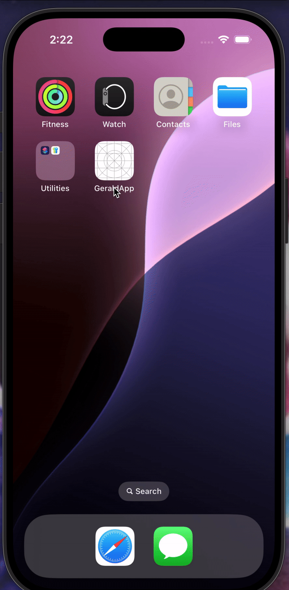

# Animated Drawer Navigation in React Native

This project implements a **custom animated drawer navigation** using `react-native-reanimated` and `react-native-gesture-handler`. The main screen smoothly scales, tilts, and shifts to reveal the drawer menu underneath.

## Features 🚀

- **Custom Animated Drawer**: The main screen rotates and scales when opening the drawer.
- **Gesture Support**: Swipe to open and close the drawer.
- **Smooth Transitions**: Uses `react-native-reanimated` for fluid animations.
- **Minimal UI**: Simple and clean layout with a dark-themed drawer.

## Demo 📸



---

## Installation 🛠️

1. **Clone the repository**

   ```sh
   git clone https://github.com/amitmundra08/GeraldApp.git
   cd GeraldApp
   ```

2. **Install dependencies**

   ```sh
   yarn install
   ```

   or

   ```sh
   npm install
   ```

3. **Install required packages**

   ```sh
   yarn add react-native-reanimated react-native-gesture-handler
   ```

4. **Enable Reanimated worklet support** (for Expo, update `babel.config.js`):

   ```js
   module.exports = {
     presets: ['module:metro-react-native-babel-preset'],
     plugins: ['react-native-reanimated/plugin'],
   };
   ```

5. **Run the app**
   ```sh
   npx react-native run-android  # For Android
   npx react-native run-ios      # For iOS
   ```

---

## Usage 💡

### Opening the Drawer

Tap the **☰ START** button or swipe right to open the drawer.

### Closing the Drawer

Tap any drawer item or swipe left to close it.

---

## Folder Structure 📂

```
📦 animated-drawer
├── 📂 src             # Store screens/componentsimages/icons
├── 📜 App.js          # Main application file
├── 📜 README.md       # Documentation file
├── 📜 package.json    # Dependencies and scripts
└── 📜 babel.config.js # Reanimated plugin setup
```

---

## Technologies Used 🛠️

- **React Native**
- **React Native Reanimated** (for animations)
- **React Native Gesture Handler** (for swipe gestures)

---

## Troubleshooting ⚠️

If you encounter issues with gestures, ensure you wrap the app with:

```jsx
import {GestureHandlerRootView} from 'react-native-gesture-handler';
<GestureHandlerRootView style={{flex: 1}}>
  <App />
</GestureHandlerRootView>;
```

If animations aren't working correctly, restart Metro:

```sh
yarn start --reset-cache
```

---
